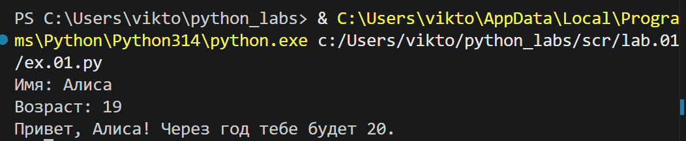
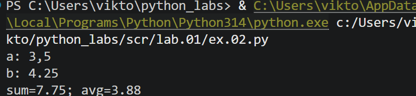
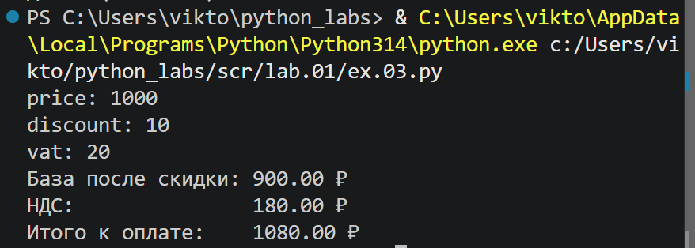
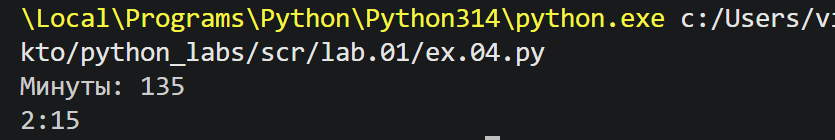
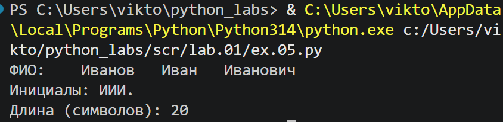
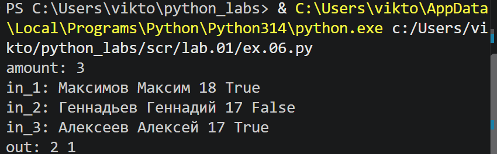
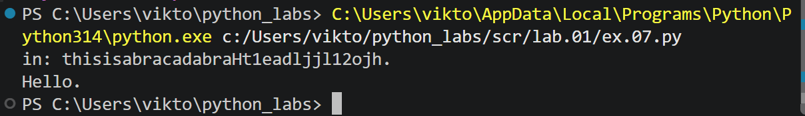

<h1>ЛР1 — Ввод/вывод и форматирование </h1>


Репозиторий содержит решения базовых задач и задач повышенной сложности (*) на применение встроенных функций ввода/вывода, базовых арифметических операций и продвинутого форматирования строк. 


<h2>Задание 1 - Привет и возраст</h2>
Программа принимает от пользователя имя и возраст, выводит значения с помощью f-строки



<h2>Задание 2 — Сумма и среднее</h2>
Программа принимает от пользователя два числа (вещественных) и меняет точку на запятую, затем выводит сумму и среднее значение в установленном формате с помощью f-строки



<h2>Задание 3 — Чек: скидка и НДС</h2>
Программа принимает от пользователя 3 вещественных числа, вычисляет значения по формулам и выводит их с использованием f-строки



<h2>Задание 4 — Минуты → ЧЧ:ММ</h2>
Программа принимает от пользователя целое число, рассчитывает значения по формулам и выводит их в установленном формате с помощью f-строки



<h2>Задание 5 — Инициалы и длина строки</h2>
Программа принимает от пользователя строку в формате ФИО, делит строку на элементы по пробелу, находит и склеивает буквы верхнего регистра для вывода инициалов, затем собирает элементы в строку через пробел и считает количество символов,в конце выводит значения с помощью f-строки



<h2>Задание 6*</h2>
Программа принимает число N, после которого идёт N-строк, каждая формата ```Фамилия Имя Возраст Формат_участия```. Ввод N строк реализуется через цикл, значения записываются в переменную, а затем с помощью функции count() реализуются счетчики True и False. Значения выводятся с помощью f-строк



<h2>Задание 7*</h2>
Программа принимает строку от пользователя строку, состоящую из различных символов без пробелов. С помощью цикла осуществляется поиск индекса первой буквы верхнего регистра. В следующем цикле программа ищет индекс первой цифры, вычисляет расстояние между индексом первой буквы верхнего регистра и первой цифры и до конца строки, пока не встретит точку, с шагом записывает значения и выводит ответ.
