<h1>ЛР2 — Коллекции и матрицы(list/tuple/set/dict) </h1>

<h2>Цели и результат</h2>

- Освоить операции над списками, кортежами, множествами и словарями.

- Научиться работать с 2D-списками (матрицами) — транспонирование, суммы по строкам/столбцам.

- Аккуратно форматировать текстовые представления записей.

<h2>Задание 1 - arrays.py</h2>

<h3>1.1 min_max</h3>

Функция принимает список чисел, сортирует его и находит наименьшее и наибольшее число. Если ей передать пустой список, она выдаст ошибку ValueError. Если минимальное или максимальное число оказалось вещественным, но без дробной части, функция убирает точку и делат его обычным целым числом. 

В конце функция возвращает кортеж (минимум; максимум).

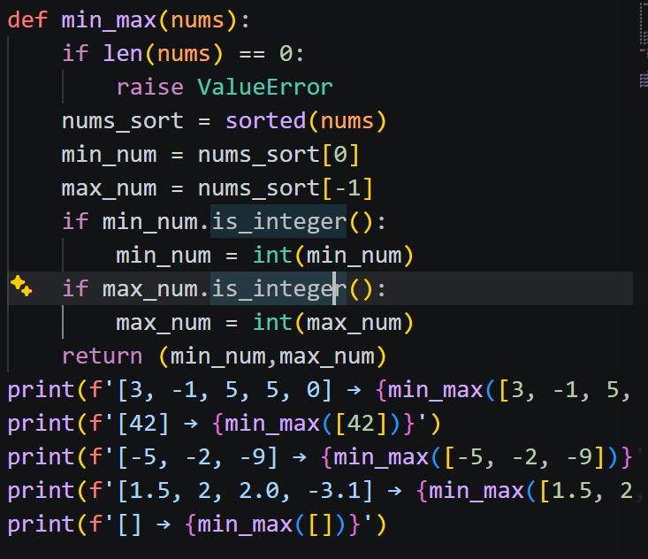

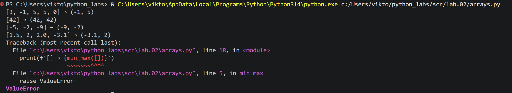

<h3>1.2 unique_sorted</h3>

Функция принимает список чисел, превращает его в множество, чтобы автоматически удалить дубликаты. Затем превращает это множество в список, ищет в нем с помощью цикла минимальное число, которое добавляет в новый список и удаляет его из исходного списка.

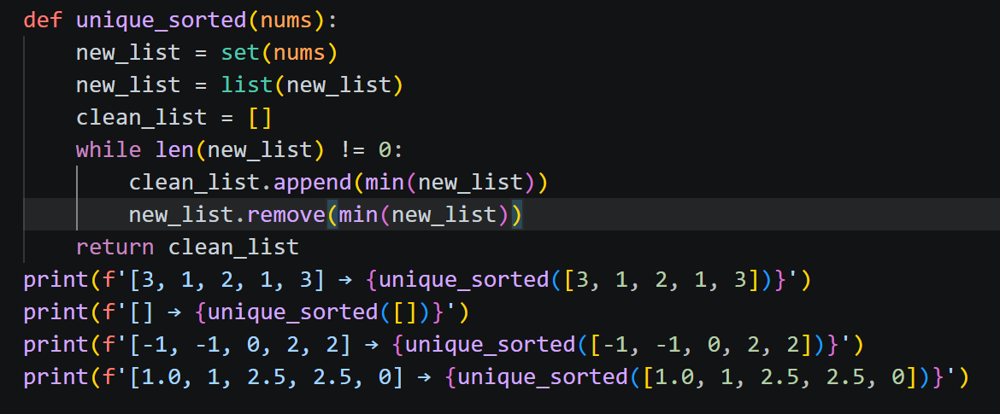

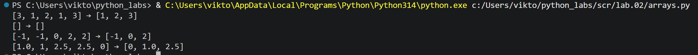

<h3>1.3 flatten</h3>

Функция принимает матрицу, по очереди перебирает все внутренние элементы. Если внутри оказывается не список и кортеж, функция выдаёт ошибку TypeError. Если всё в порядке, она объединяет содержимое элемнтов в один общий список и возвращает его.

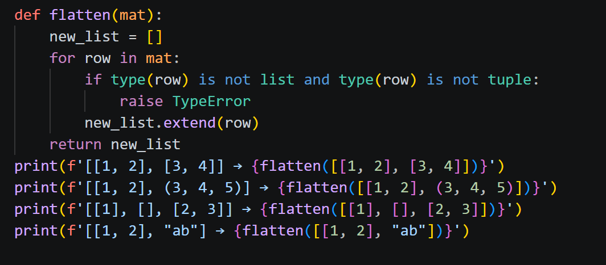

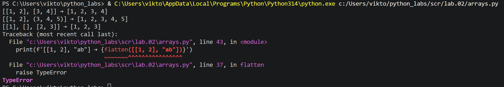

<h2>Задание 2 — matrix.py</h2>

<h3>2.1 transpose</h3>

Функция принимает матрицу. Если строки в матрице окажутся разной длины, она выведет ошибку ValueError. Если передать пустую матрицу, она вернет пустой список. Если все хорошо, функция собирает новую матрицу, превращает каждую строку в столбец.

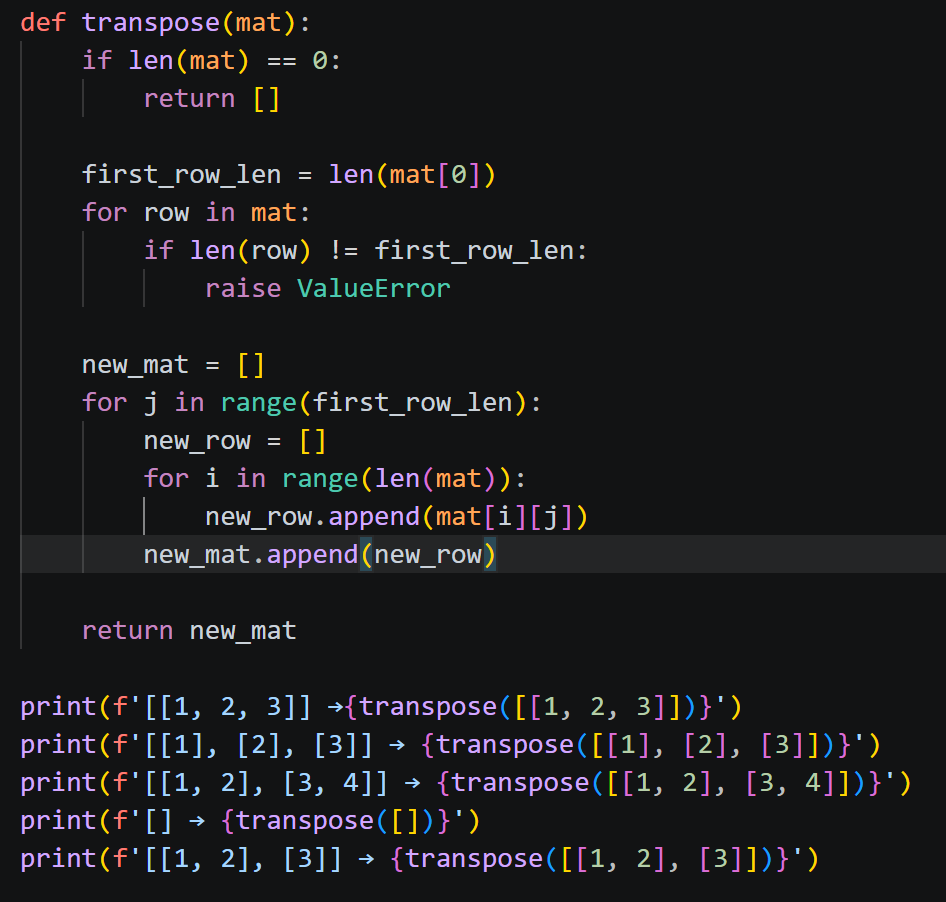

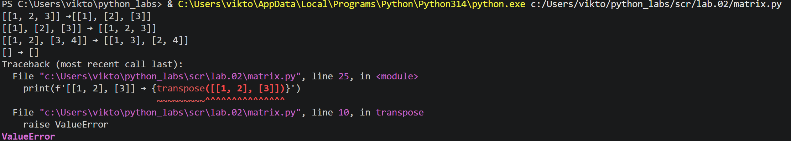

<h3>2.2 row_sums</h3>

Функция приниммает матрицу, измеряет длину первой строки и сравнивает с остальными. Если строки в матрице имеют разную длину, она выдает ошибку ValueError. Если все в порядке, функция суммирует значения строки и добавляет в новый список.

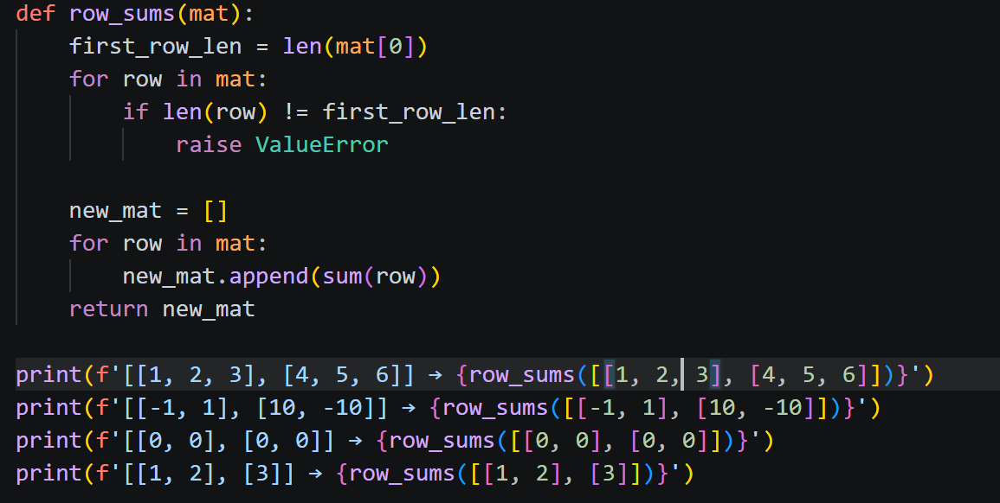

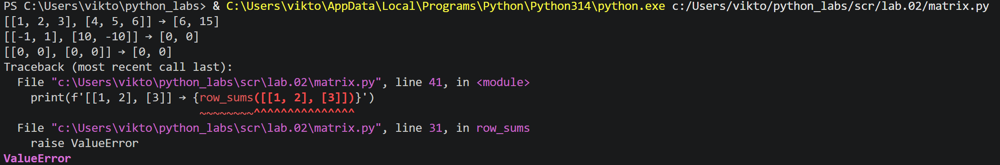

<h3>2.3 col_sums</h3>

Функция принимает матрицу, измеряет длину первой строки и сравнивает с остальными строками. Если строки разные по длине, она выводит ошибку ValueError. Если все в порядке, функция складывает значения столбца и добавляет в новый список.

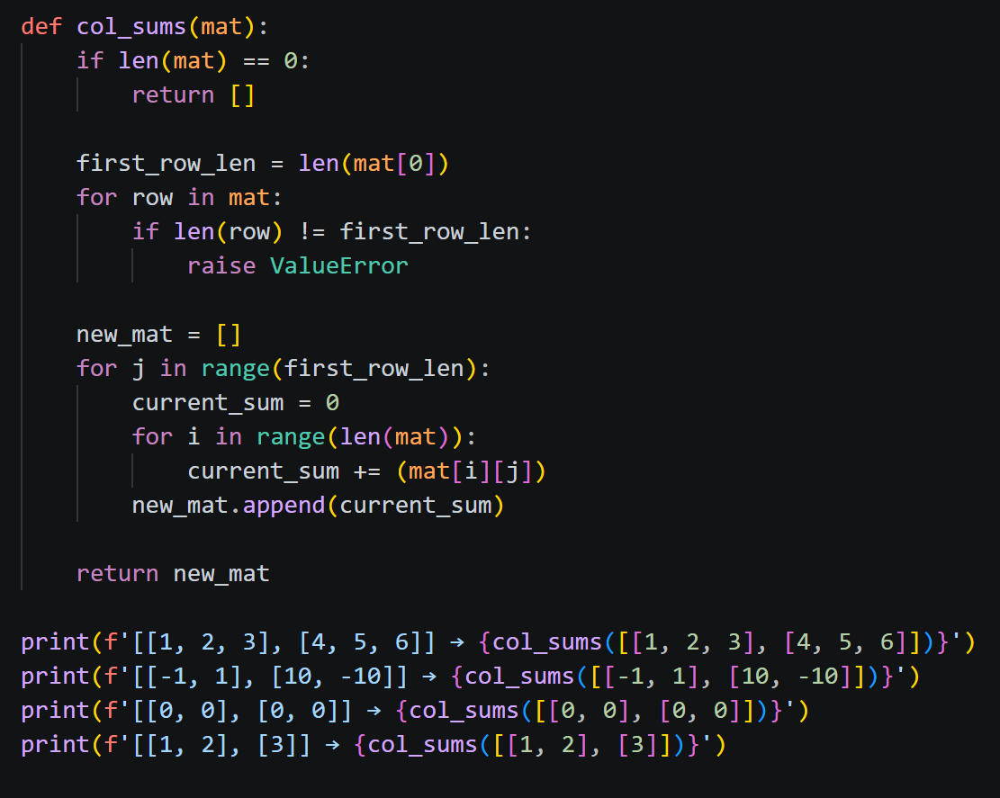

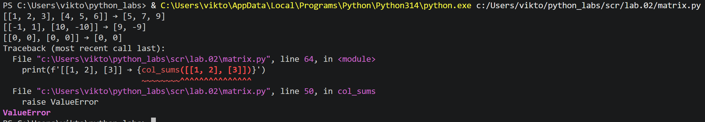

<h2>Задание 3 — tuples.py</h2>

Функция принимает кортеж. Если данные указаны не в том формате, она выводит ошибку TypeError. Если в ФИО меньше 2 элементов, группа не указана или GPA вне диапазона, она выводит ValueError. Если все в порядке, функция собирает данные в строку: инициалы, группу, балл GPA c двумя знаками после точки.

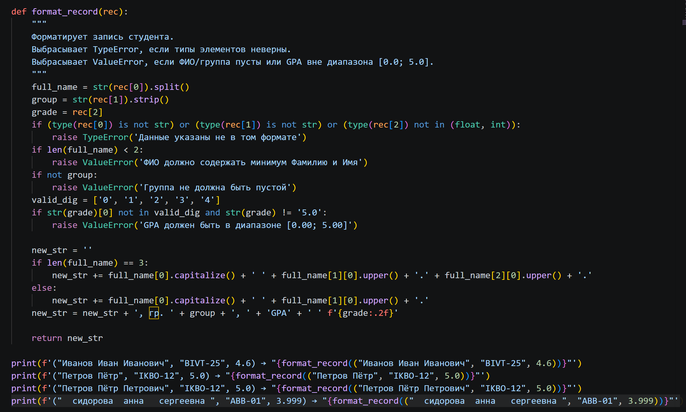

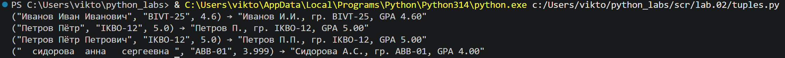

